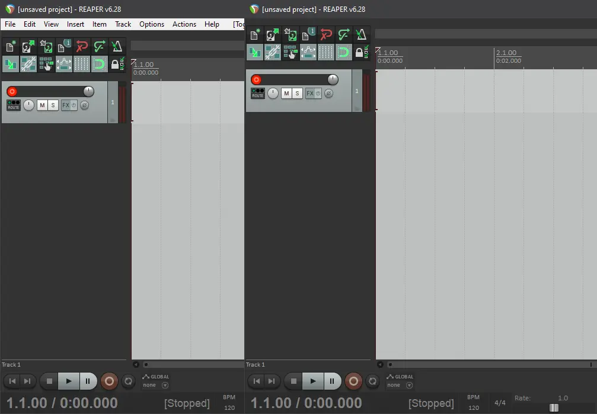
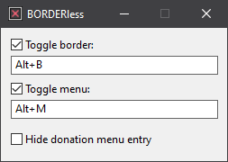

<h1 align="center">BORDERless</h1>

<!--

# BORDERless
-->

Hide (and restore) window borders and/or menu bar.

Download the [latest release](https://github.com/ubihazard/borderless/releases).

## Description

On Windows 10 (8? 8.1? 11?), for whatever reason, some (legacy) fullscreen applications are displayed with ugly borders around their frame. This little utility allows to turn these borders off.

As a bonus feature, it now also has an ability to toggle window menus on and off. This is handy for achieving uniform look and feel in applications where fixed menu bar is annoying and/or undesirable, and cannot be turned off in settings: emulators, any dark mode (professional) applications with white menu bar stuck in them, etc.

*Note that BORDERless can only hide standard Windows menu bars. If an application has a custom menu implemented through some graphical interface toolkit, BORDERless wouldn’t be able to affect it.*

## How to Use

BORDERless now works on active windows and uses Windows global hotkeys API to trigger its actions. The default shortcuts are <kbd>Alt+B</kbd> to toggle window borders and <kbd>Alt+M</kbd> to toggle menu.

Make sure the window you are trying to change is activated and press the appropriate key combination for the desired effect. If a certain hotkey isn’t working, then it’s probably already in use by some other app running on your system.

It is possible to configure your own hotkeys:

(The app can be interacted with from the system tray by clicking on its icon.)

Run `install.bat` to create the Start Menu shortcut for easy access to BORDERless.

No bloat: BORDERless is written in pure C / WinAPI and consumes bare minimum of system resources (around a megabyte of RAM). So you can safely let it running in background.

*Note: some windows require you to <kbd>Alt-Tab</kbd> away and back to them after applying the fix in order to actually see the effect. That’s because Windows doesn’t bother to repaint them immediately. Doh.*

### Changing the Way Borders Are Hidden

Borders are hidden by applying window style masks. These masks can be modified by editing the configuration file `config` located in the program directory on lines 3-4. In order for this file to appear BORDERless needs to be run at least once.

By default, `0xcf0000` and `0x20301` values are used, which work best for hiding borders in fullscreen multimedia windows, but might cause graphical UI weirdness in regular windows. For regular windows the values `0xcb0000` and `0x20300` are recommended instead.

## Support

If you find [BORDERless](https://github.com/ubihazard/borderless) useful, you can [buy me a ☕](https://www.buymeacoffee.com/ubihazard "Show support")!
